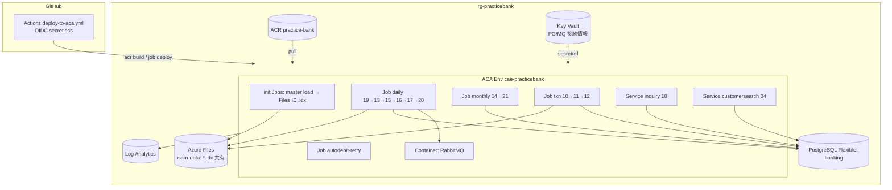
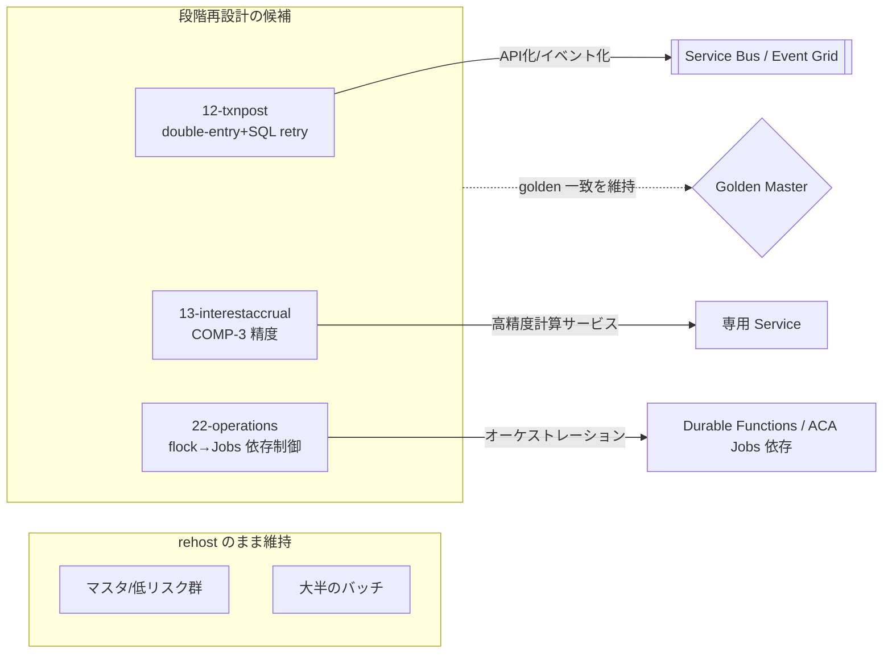

# Azure アーキテクチャ — 理想形（target / to-be）

> 現状(as-built): [docs/architecture-azure.md](architecture-azure.md)。本書は **あるべき姿**。
> 方針: rehost コンテナ（Java 直訳しない・ADR-0027）、ジョブ/サブシステム単位（ADR-0026）、golden 担保。
> 段階: **短期(MVP完成形) → 中期(Replatform) → 長期(Refactor)**。

## 1. 短期: MVP 完成形（現状ギャップを埋めた姿）

現状の「動くが共有されていない/手動」を、設計どおりに整える。



**短期で埋めるギャップ**
- **ISAM = Azure Files 共有**（init が書く→各ジョブが読む。エフェメラル脱却）
- **RabbitMQ コンテナ配備**（20-integrationout の外部連携）
- **Key Vault に接続情報集約**（手動 secret 脱却・managed identity 参照）
- **IaC 写経**（infra/main.bicep + azd up で再現可能化・ADR-0029）
- **ジョブ identity に AcrPull**（admin creds 脱却）

## 2. 中期: Replatform（運用をクラウドネイティブに）

```mermaid
flowchart TB
  subgraph RG[rg-practicebank]
    subgraph ENV[ACA Env]
      JOBS[Jobs cron: daily/monthly/hourly<br/>+ KEDA スケール]
      SVC[Services: inquiry/customersearch<br/>+ ingress/HTTPS]
    end
    PGHA[(PostgreSQL Flexible<br/>HA(ゾーン冗長)+自動バックアップ)]
    SB[[Azure Service Bus<br/>RabbitMQ 置換 PoC]]
    MON[Azure Monitor + Alerts<br/>+ Workbook ダッシュボード]
    BLOB[(Blob: 明細/帳票出力)]
  end
  JOBS --> PGHA & SB & BLOB
  SVC --> PGHA
  JOBS --> MON
```

**中期の要点**
- バッチ = **ACA Jobs cron**（systemd timer 廃止）、必要に応じ **KEDA** で needs-based 起動
- **PostgreSQL HA**（ゾーン冗長）＋ バックアップ/PITR、メンテナンスウィンドウ
- **RabbitMQ → Service Bus** を PoC（マネージドで運用負荷減）
- 明細(17)の出力は **Blob** へ（帳票配信）
- **Azure Monitor + アラート + Workbook** で監視標準化

## 3. 長期: Refactor（ホットスポットのみ段階再設計）



**長期の要点**
- **全面書き換えはしない**。価値/リスクの高い 3 点（12/13/22）だけ段階再設計
- ISAM → **PostgreSQL/Blob へ統合**（ファイル依存の解消）
- MQ → **Service Bus 本採用**、イベント駆動（outbox→Service Bus）
- オーケストレーション(22) → **Durable Functions or ACA Jobs 依存**で flock 脱却
- **どの段階でも golden master 一致を不変条件**として維持（ADR-0005）

## セキュリティ/運用の通底テーマ
- **secretless**: Entra OIDC + managed identity + Key Vault（パスワード平文を排除）
- **最小権限**: ジョブ identity に必要ロールのみ（AcrPull/DB接続）
- **ネットワーク**: 将来は VNet 統合 + Private Endpoint（PG/MQ を非公開化）
- **再現性**: すべて Bicep + azd（手動構築をコード化）
- **可観測性**: Log Analytics + Monitor + golden 差分を CI で可視化

## 段階比較（再掲・評価軸）
| 軸 | 短期 Rehost完成 | 中期 Replatform | 長期 Refactor |
|---|---|---|---|
| 実装難易度 | 低 | 中 | 高 |
| 業務リスク | 低 | 中 | 中〜高 |
| 運用性 | 中 | 高 | 高 |
| Azure適合 | 中 | 高 | 最高 |
| 保守性 | 低 | 中 | 高 |
