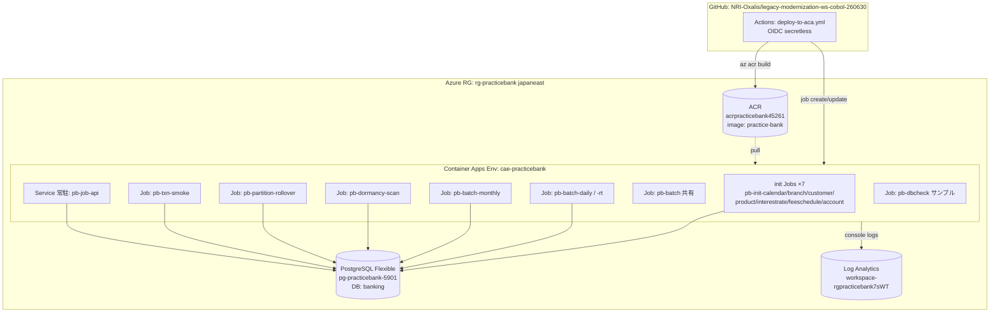

# Azure アーキテクチャ（現状 / as-built）

> 2026-06-30 時点の実機構成（RG `rg-practicebank` / japaneast）。MVP は az で即興構築、IaC は後追い（ADR-0029）。
> ※ このドキュメントは「いま動いている姿」。設計理想は [docs/azure-migration-strategy.md](azure-migration-strategy.md)。

## 構成図

## リソース一覧（as-built）
| 種別 | 名前 | 役割 |
|---|---|---|
| Container Registry | `acrpracticebank45261` | 共有イメージ `practice-bank` |
| Container Apps Env | `cae-practicebank` | Jobs/Service 実行基盤 |
| Log Analytics | `workspace-rgpracticebank7sWT` | コンソールログ集約 |
| PostgreSQL Flexible | `pg-practicebank-5901` | DB `banking`（取引/残高/監査/マスタ） |
| init Jobs ×7 | `pb-init-*` | マスタロード（ISAM 生成） |
| Batch Jobs | `pb-batch-daily(-rt)` / `pb-batch-monthly` / `pb-dormancy-scan` / `pb-partition-rollover` / `pb-txn-smoke` / `pb-batch` | 日次/月次/休眠/監査/取引 |
| Service | `pb-job-api` | 常駐 API |
| Sample | `pb-dbcheck` | DB 疎通サンプル |

## CI/CD
- GitHub Actions `deploy-to-aca.yml` → Entra OIDC（secretless）→ `az acr build` → `az containerapp job create/update`。

## 既知のギャップ（正直ベース）
- **ISAM が永続化されていない**: Azure Files マウント未設定。各ジョブが実行時に `make`＋ロードで `.idx` をエフェメラル生成（共有されない）。設計（Azure Files）に寄せるのは余裕時タスク。
- **RabbitMQ 未配備**: 外部連携(20)は MQ コンテナ or Service Bus が必要。現状なし。
- **接続情報が手動 secret**: Key Vault 集約は後追い。
- **IaC 後追い**: 現状は az 即興構築。Bicep 写経で再現可能化が残タスク（ADR-0029）。
